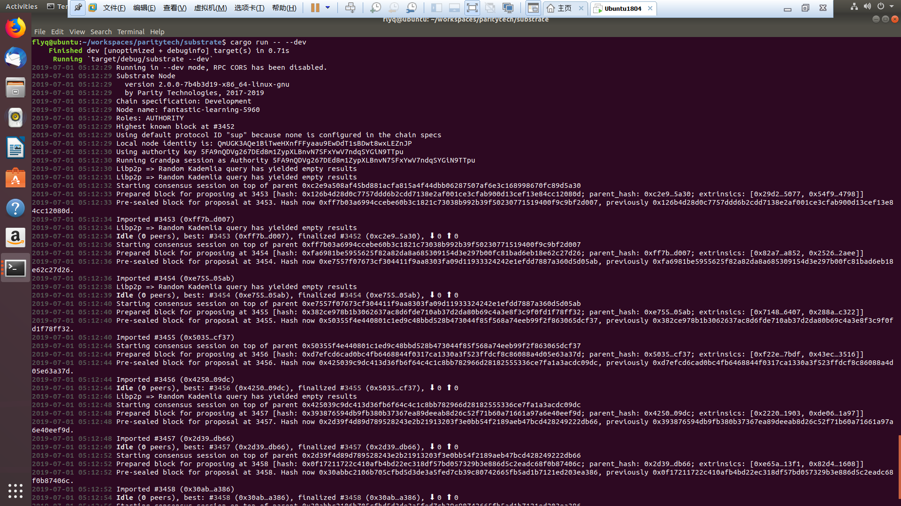

# Install

参考 [Substrate 官方文档](https://github.com/paritytech/substrate#6-building)：

> ## 6. Building
> ### 6.1. Hacking on Substrate
> If you’d actually like to hack on Substrate, you can just grab the source code and build it. Ensure you have Rust and the support software installed:  
> 
> #### 6.1.1. Linux and Mac  
> For Unix-based operating systems, you should run the following commands:
>
> ```bash
> curl https://sh.rustup.rs -sSf | sh
> 
> 
> rustup update nightly
> rustup target add wasm32-unknown-unknown --toolchain nightly
> rustup update stable
> cargo install --git https://github.com/alexcrichton/wasm-gc
> ```
> You will also need to install the following packages:
>
> * Linux:
> 
> ```bash
> sudo apt install cmake pkg-config libssl-dev git clang libclang-dev
> ```
> * Mac:
> ```bash
> brew install cmake pkg-config openssl git llvm
> ```
> #### 6.1.3. Shared Steps
> Then, grab the Substrate source code:
> ```bash
> git clone https://github.com/paritytech/substrate.git
> cd substrate
> ```
> Then build the code:
> ```bash
> ./scripts/build.sh          # Builds the WebAssembly binaries
> cargo build                 # Builds all native code
> ```
> You can run all the tests if you like:
>
> ```bash 
>  cargo test --all
> ```
> Or just run the tests of a specific package (i.e. `cargo test -p srml-assets`)
>
> You can start a development chain with:
> ```bash
> cargo run \-- --dev
> ```
> Detailed logs may be shown by running the node with the following environment variables set: `RUST_LOG=debug RUST_BACKTRACE=1 cargo run -- --dev`.
>
> If you want to see the multi-node consensus algorithm in action locally, then you can create a local testnet with two validator nodes for Alice and Bob, who are the initial authorities of the genesis chain specification that have been endowed with a testnet DOTs. We’ll give each node a name and expose them so they are listed on Telemetry . You’ll need two terminals windows open.
> 
> We’ll start Alice’s substrate node first on default TCP port 30333 with her chain database stored locally at `/tmp/alice`. The Bootnode ID of her node is `QmRpheLN4JWdAnY7HGJfWFNbfkQCb6tFf4vvA6hgjMZKrR`, which is generated from the `--node-key` value that we specify below:
> 
> ```bash
> cargo run --release \-- \
>  --base-path /tmp/alice \
>  --chain=local \
>  --alice \
>  --node-key 0000000000000000000000000000000000000000000000000000000000000001 \
>  --telemetry-url ws://telemetry.polkadot.io:1024 \
>  --validator
> In the second terminal, we’ll run the following to start Bob’s substrate node on a different TCP port of 30334, and with his chain database stored locally at /tmp/bob. We’ll specify a value for the `--bootnodes` option that will connect his node to Alice’s Bootnode ID on TCP port 30333:
> 
> ```bash 
> cargo run --release \-- \
>  --base-path /tmp/bob \
>  --bootnodes /ip4/127.0.0.1/tcp/30333/p2p/QmRpheLN4JWdAnY7HGJfWFNbfkQCb6tFf4vvA6hgjMZKrR \
>  --chain=local \
>  --bob \
>  --port 30334 \
>  --telemetry-url ws://telemetry.polkadot.io:1024 \
>  --validator
> ```
> Additional Substrate CLI usage options are available and may be shown by running `cargo run -- --help`.
> 

最后， `cargo run \-- --dev` ， `Substrate` 就开始出块了：


